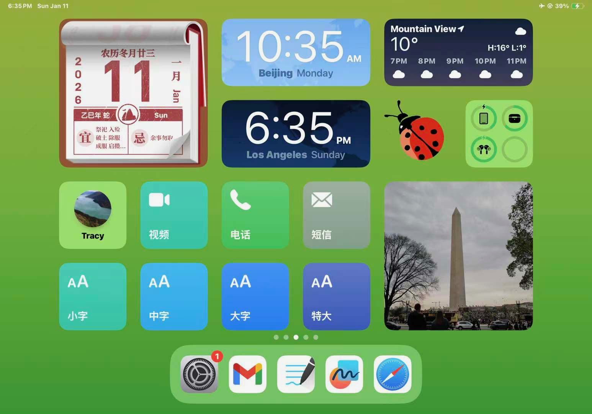
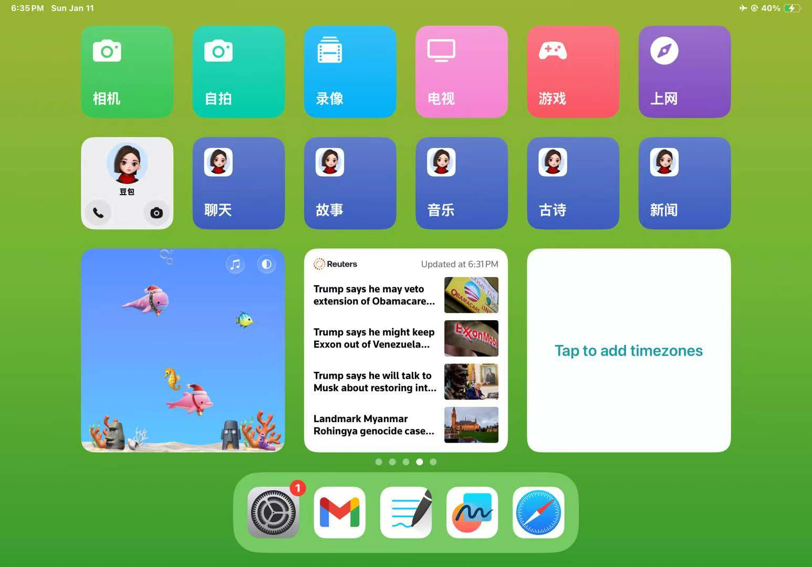

# Grandpa Arcade (爷爷的游戏厅) 🎮❤️
<p align="center">
  
</p>

A tiny, warm web arcade made for my 96-year-old grandpa.

**Big buttons. Big fonts. Simple rules. No ads.**  
Just a calm place to play a few friendly mini-games every day.

---

## ✨ What’s inside

### ✅ 1) Idiom Fill-In (成语填词)
- 4-character idiom with 1 missing character  
- Tap the correct option  
- 10 random questions per session (fresh every time)

### ✅ 2) Daily Math (每日算数)
- 10 quick problems (mostly +/−, optional ×/÷)  
- Giant keypad input  
- Friendly feedback + optional voice praise  
- **Hint / Skip** so grandpa never gets stuck

### ✅ 3) Push the Boxes (推箱子)
- Grandpa 👴 pushes 📦 onto ⭕ — 15 gentle levels, all checked to be solvable
- Giant arrow pad, or tap the side of the board he wants to walk to
- **退一步 (undo)** and **重来 (restart)** anytime; a 🐵 helper can walk him to the next push
- Notices when a box is stuck for good and suggests 退一步; remembers which level he reached

### ✅ 4) Grandpa vs. Monkey (爷爷战猴子)
- A drawing race: grandpa traces a dotted picture (sun, heart, star, house…) while 🐵 draws the same one
- The closer the trace, the higher the score; best of 5 rounds
- No timer — the monkey finishes and waits; **擦掉重画** wipes the page to try again

---

## 🧓 Design principles (Grandpa-first)
- **Readable**: oversized typography and high contrast  
- **Touchable**: huge hit targets, minimal precision required  
- **Unbreakable**: offline-friendly static assets, no fragile external links  
- **Calm**: no clutter, no hidden gestures, no tiny UI  

---

## 📱 Grandpa's iPad

<p align="center">
  
  
</p>

---

## 🗂 Project structure

```text
grandpa-arcade/
├─ public/
│  └─ games/
│     ├─ idiom/
│     │  ├─ index.html
│     │  ├─ idioms.json
│     │  └─ assets/
│     │     └─ correct.mp3
│     └─ math/
│        ├─ index.html
│        └─ assets/
│           ├─ click.mp3
│           ├─ correct.mp3
│           ├─ wrong.mp3
│           └─ win.mp3
├─ src/
│  ├─ app/
│  │  └─ App.jsx
│  ├─ data/
│  │  └─ games.jsx
│  └─ styles/
│     └─ globals.css
├─ index.html
├─ vite.config.js
├─ vercel.json
└─ package.json
```

---

## 🚀 Quickstart

### 1) Install
```bash
npm install
```

### 2) Run locally
```bash
npm run dev -- --host
```

Open:
- **Home:** http://localhost:5173/  
- **Idiom:** http://localhost:5173/games/idiom/  
- **Math:** http://localhost:5173/games/math/  

### 3) Build
```bash
npm run build
```

### 4) Preview production build
```bash
npm run preview -- --host
```

---

## 🌐 Deploy to Vercel

This project is Vercel-friendly out of the box.

**Build settings**
- Build Command: `npm run build`
- Output Directory: `dist`

`vercel.json` supports:
- Static game pages under `/games/*`
- SPA route refresh fallback to `/index.html`

---

## 🧠 Idiom database format (`idioms.json`)

`public/games/idiom/idioms.json` should be an array of objects:

```json
[
  {
    "text": "画龙点睛",
    "answerIndex": 3,
    "options": ["睛", "雨", "马", "花"]
  }
]
```

Rules:
- `text` must be **exactly 4 Chinese characters**
- `answerIndex` must be **0–3**
- `options` must include the correct character

---

## 🔊 Audio assets

To keep things stable on iPad (Safari), prefer **.mp3** (avoid `.ogg`).

Recommended placement:
- `public/games/idiom/assets/correct.mp3`
- `public/games/math/assets/{click,correct,wrong,win}.mp3`

Convert `.ogg` → `.mp3` (ffmpeg):
```bash
ffmpeg -i input.ogg -ac 1 -ar 44100 -b:a 128k output.mp3
```

---

## ➕ Adding a new game

1) Create a folder:
```text
public/games/<game-id>/index.html
```

2) Add it to the home menu config (e.g. `src/data/games.jsx`) with:
- `id`, `title`, `hint`, `iconKey`
- `url: "/games/<game-id>/"`

3) Keep it grandpa-friendly:
- big UI
- clear feedback
- no complex menus

---

## ❤️ A note

This is a love project.

If it helps grandpa smile for even a minute, it’s already worth it.
